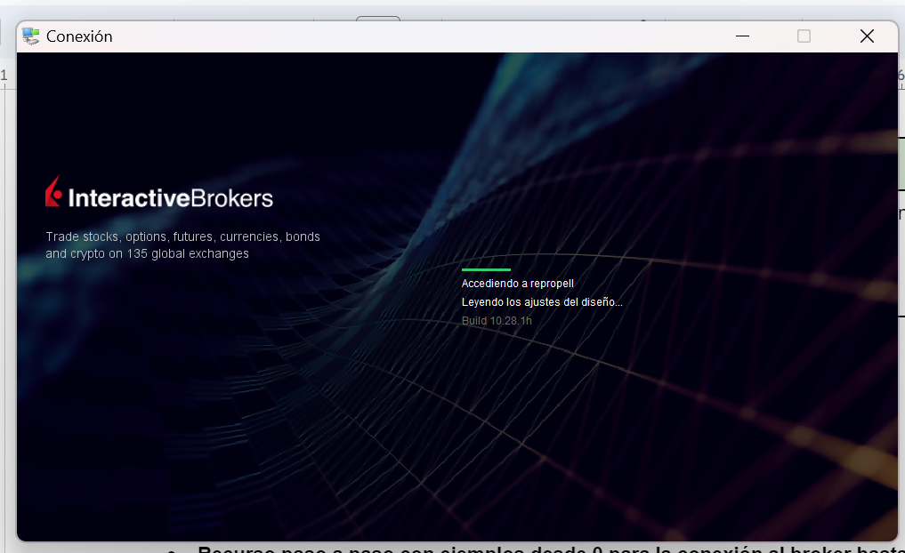
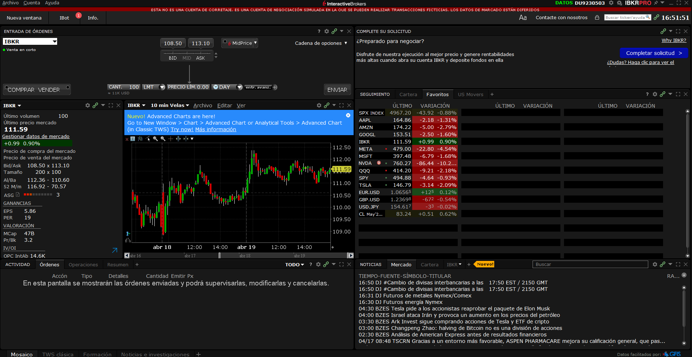
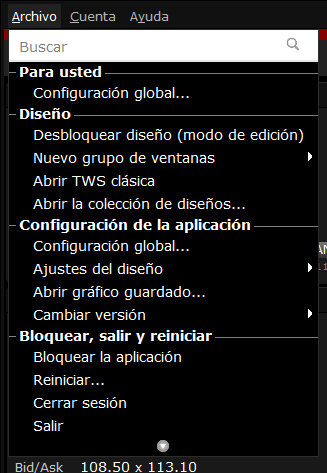
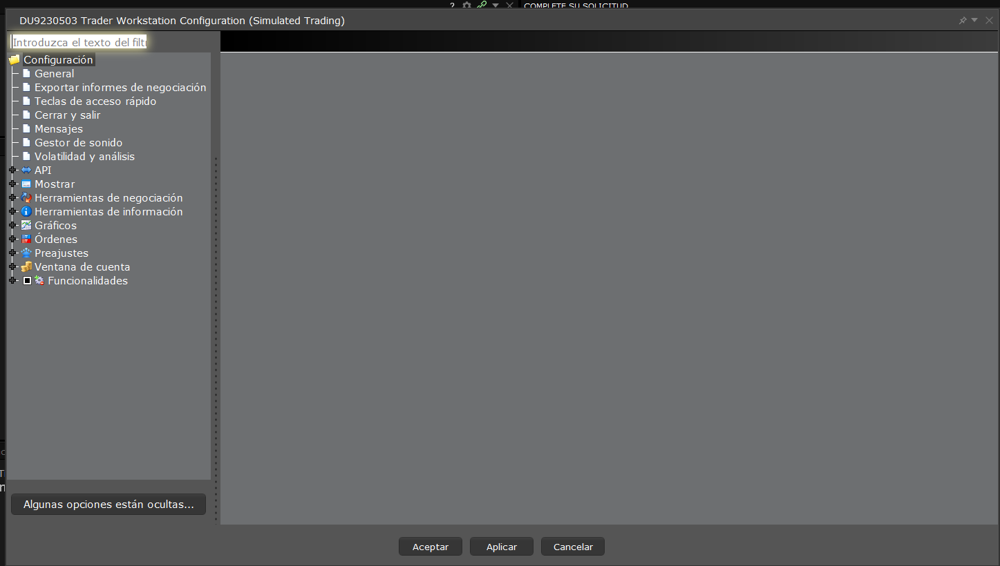

# Curso de IBKR: Python TWS API
|[Atrás](./leccion2.1.md "Atrás")|[Siguiente](./leccion2.3.md "Siguiente")|
|---|---:|

## Lección 2: Instalación y configuración de TWS para la API

### 2.2 Instalación de TWS

Después de ejecutar el instalador, TWS se instalará localmente y se creará un nuevo icono en el escritorio. Al hacer doble clic en el icono, aparecerá la pantalla de inicio de sesión de TWS que tiene entradas para ingresar manualmente un nombre de usuario y contraseña. También hay una opción donde puede seleccionar iniciar sesión en su cuenta real o en papel. 

Las cuentas en papel son compatibles con la API de TWS y se recomienda probar todos los programas en un entorno en papel antes de pasar al comercio de producción.

Si no tiene una cuenta de IB, es posible iniciar sesión en una cuenta de demostración haciendo clic en el enlace "Pruebe la demostración" y utilizando una dirección de correo electrónico.

Las cuentas de demostración son compatibles con la API de TWS , aunque no tendrán datos en vivo disponibles para la mayoría de los tipos de instrumentos. 

Para recibir datos de velas históricas o en vivo desde la API, primero es necesario tener habilitados los permisos de datos en vivo en TWS. Para la mayoría de los tipos de instrumentos, esto requiere primero tener una cuenta real con fondos y suscripciones activas a datos de mercado.

Una vez que haya iniciado sesión completamente en TWS y se haya cargado completamente por primera vez, hay una configuración que debe habilitarse para permitir la conexión API y varias otras que algunos usuarios deciden configurar de manera diferente para sus aplicaciones.  

La configuración de API se puede configurar en Configuración global en API  Configuración.

Aparece esto:

|[Atrás](./leccion2.1.md "Atrás")|[Siguiente](./leccion2.3.md "Siguiente")|
|---|---:|
